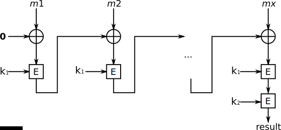

This is the second installment of our MAC series, read the previous posts to have a better understanding of what a MAC is and how it can be used to guarantee message integrity.

1. [Message Authentication Code (MAC)](/message-authentication-code)
2. **Encrypted CBC-MAC (ECBC)**
3. NMAC
4. PMAC
5. HMAC
6. Poly1305-AES

In this post we will learn about MACs constructed using _block ciphers_ by learning about the `ECBC`.

## ECBC

ECBC, or encrypted CBC-MAC is a technique for constructing a message authentication code from a block cipher. Messages are encrypted with some block cipher algorithm in CBC mode to create a chain of blocks such that each block depends on the proper encryption of the previous block.

We have a [previous posts](/cbc-bitflipping-attack) explaining how CBC works, it will be helpful to have a grasp on the subject before moving forward. We will start by investigating how ECBC works through a diagram and we can discuss the implementation details afterwards.



**Similarities between `ECBC` and `CBC`:**

1. Like `CBC` we have an _initialization vector (IV)_ which is usually set to `zero` in this algorithm.
2. Our message is still divided into _blocks_ of `16` bytes assuming the encryption process is based on `AES-128`.
3. Every encrypted block will be XORed with the next block before being encrypted under the _same key_.

**Differences between `ECBC` and `CBC`:**

1. After the last block is encrypted we have a _second key_ that will encrypt the final result of the chain.

It's crucial for this second encryption to use a _different key_, without it we could forge a message from a previous message and tag. Before we attempt to exploit this vulnerability, let's implement this algorithm.

## Implementation

Most of the code here was already covered up in previous posts, the most relevant one for our understanding being the [CBC Bitflipping Attack](/cbc-bitflipping-attack). Our example will assume that our messages are _block aligned_ and no padding is required for now.

```ruby
require 'openssl'

BLOCK_SIZE = 16
KEY1 = BLOCK_SIZE.times.map { rand(0..255) }
KEY2 = BLOCK_SIZE.times.map { rand(0..255) }
ZERO_IV = Array.new(BLOCK_SIZE, 0)
MESSAGE = 'ECBC is not as hard as I thought! I want a tag!!'.bytes

def aes_ecb_encrypt(message, key)
  cipher = OpenSSL::Cipher.new('AES-128-ECB')
  cipher.encrypt
  cipher.key = key.pack('C*')
  cipher.padding = 0 # no padding
  result = cipher.update(message.pack('C*')) + cipher.final
  result.unpack('C*')
end

# Slightly modified from our previous implementation, now
# we are just keeping the last encryption as opposed to the
# encryption for every block.
def aes_cbc_encrypt(message, key, iv)
  blocks = message.each_slice(key.size)
  previous_encryption = iv

  blocks.each do |block|
    xor = previous_encryption.zip(block).map { |a, b| a ^ b }
    previous_encryption = aes_ecb_encrypt(xor, key)
  end

  previous_encryption
end

def ecbc_sign(key1, key2, message)
  cbc_result = aes_cbc_encrypt(message, key1, ZERO_IV)
  aes_ecb_encrypt(cbc_result, key2).pack('C*')
end

def ecbc_verified?(key1, key2, message, tag)
  ecbc_sign(key1, key2, message) == tag
end

tag = ecbc_sign(KEY1, KEY2, MESSAGE)
puts ecbc_verified?(KEY1, KEY2, MESSAGE, tag) # true
puts ecbc_verified?(KEY1, KEY2, MESSAGE, 'wrong') # false
```

As we can see every step of the chain requires the computation of the previous step, making the algorithm impossible to parallelize. Let's move on and explore the reason we need a second key in ECBC.

## Example of an implementation mistake

Suppose we forgot to encrypt the final result of our CBC-MAC chain using a different key, how can this be exploited in order to forge a new message?

To make it clear we are changing this method:

```ruby
def ecbc_sign(key1, key2, message)
  cbc_result = aes_cbc_encrypt(message, key1, ZERO_IV)
  aes_ecb_encrypt(cbc_result, key2).pack('C*')
end
```

<br /> to:

```ruby
def ecbc_sign(key, message)
  aes_cbc_encrypt(message, key1, ZERO_IV)
end
```

### Attack

Let's imagine we have a message with a single block and we want to generate a tag for it.

The way the tag would be generated is:

Step 1: `result = zero_iv XOR message` <br />
Step 2: `tag = ENCRYPT(key, result)`

How can we forge a new message with _two blocks_ and the _same tag_ based on this knowledge?

1. Repeat the message for the first block
2. Create a second block with value `tag XOR message`

This is all we need to generate the _same tag_ for and entirely different message! Let's deconstruct the operations to see why:

Step 1: `result = zero_iv XOR message` <br />
Step 2: `c0 = ENCRYPT(key, result)` <br />
Step 3: `c0 XOR tag XOR message` <br />
Step 4: `tag = ENCRYPT(key, c0 XOR tag XOR message)` <br />
Which really is:`tag = ENCRYPT(key, message)`

The trick here is that `c0` and `tag` are exactly the same, so when we XOR both they will cancel each other and only the message remains!

Let's implement this!

```ruby
require 'openssl'

BLOCK_SIZE = 16
KEY = BLOCK_SIZE.times.map { rand(0..255) }
ZERO_IV = Array.new(BLOCK_SIZE, 0)
MESSAGE = "I'm unforgeable!".bytes

def aes_ecb_encrypt(message, key)
  cipher = OpenSSL::Cipher.new('AES-128-ECB')
  cipher.encrypt
  cipher.key = key.pack('C*')
  cipher.padding = 0 # no padding
  result = cipher.update(message.pack('C*')) + cipher.final
  result.unpack('C*')
end

def aes_cbc_encrypt(message, key, iv)
  blocks = message.each_slice(key.size)
  previous_encryption = iv

  blocks.each do |block|
    xor = previous_encryption.zip(block).map { |a, b| a ^ b }
    previous_encryption = aes_ecb_encrypt(xor, key)
  end

  previous_encryption
end

# This is now broken and cannot guarantee integrity anymore.
def ecbc_sign(key, message)
  aes_cbc_encrypt(message, key, ZERO_IV)
end

def ecbc_verified?(key, message, tag)
  ecbc_sign(key, message) == tag
end

tag = ecbc_sign(KEY, MESSAGE)
forged_message = MESSAGE + tag.zip(MESSAGE).map { |a, b| a ^ b }
new_tag = ecbc_sign(KEY, forged_message)

puts ecbc_verified?(KEY, MESSAGE, tag) # true
puts ecbc_verified?(KEY, forged_message, new_tag) # true
puts tag == new_tag # true
```

<br />

And that's all we need to understand the encrypted CBC-MAC algorithm.

I will leave this post mentioning that if we are able to obtain tags for _two one-block messages_ we can also generate a new message that is the concatenation of these messages. Reach out to me via email or Twitter if you would like to share or validate your solution. :)

Our next post will cover `NMAC`, which is the basis for other interesting constructs. See you there!
