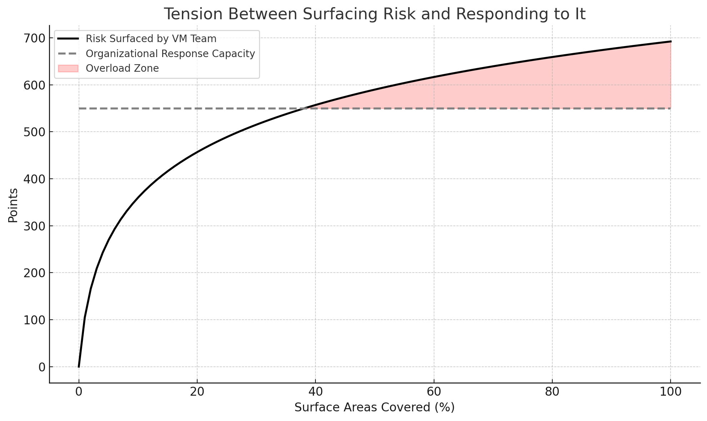
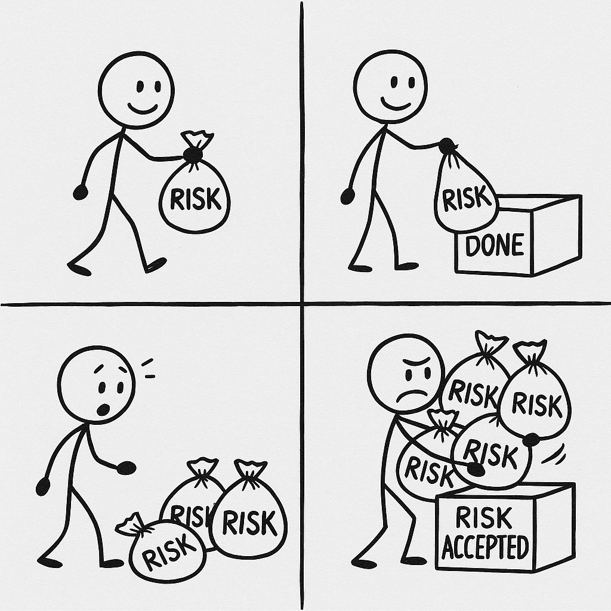

One of the most common mistakes I see Vulnerability Management (VM) teams make is _surfacing every identified risk_ to the broader organization—without considering whether the organization has the capacity to act on it. Let's explore why this can backfire.

As VM teams mature, they expand automation across more surface areas, surfacing more risk in the process. But the organization’s capacity to remediate risk often remains fixed. This mismatch creates mounting pressure.

Once the volume of surfaced risk exceeds the organization’s ability to respond, something predictable happens.

Teams begin to feel overwhelmed. Requests from security start taking longer to resolve or are ignored entirely. Over time, the Vulnerability Management team risks losing credibility and goodwill across the organization.

### So What Should Vulnerability Management Teams Do?

Instead of surfacing every risk as a discrete task, VM teams should focus on creating continuous mechanisms for reducing risk. Think in terms of policy and automation rather than one-off requests. Use discrete tasks sparingly, reserving them for critical, time-sensitive vulnerabilities, like CVEs with known exploits or reproducible bug bounty reports.

With the right metadata about services, hosts, or dependencies in place, the VM team can quickly assess the critical systems and deprioritize most of the tasks. There are common themes to consider when assessing risk across any program:
- Which invariants are in place? Can we test they are never broken?
- Is the service exposed to the internet?
- Do we have clear ownership of assets?
- Is egress being enforced?

Here are some practical examples of what specific programs might look like:
- **Automate OS patching**: Instead of asking service owners to manually update OS packages, rotate hosts regularly using up-to-date images
- **Weigh context for library updates**: Before surfacing a task to developers, consider whether the vulnerable dependency is only used in development, and whether the application is externally exposed
- **Gate risky dependencies**: Block the introduction of dependencies with known critical vulnerabilities unless manually reviewed
- **Harden container policies**: Require containers to be rebuilt frequently, and enforce use of minimal images.

These examples only scratch the surface. The right policies and automations depend heavily on your organization's structure and risk tolerance. But the takeaway is the same: make discrete tasks exceptional, and they’ll be treated as such.

The next time your team rolls out a new Vulnerability Management program, ask yourself: can most of this risk be addressed through automation or policy? That answer will shape whether your program earns engagement or resistance.